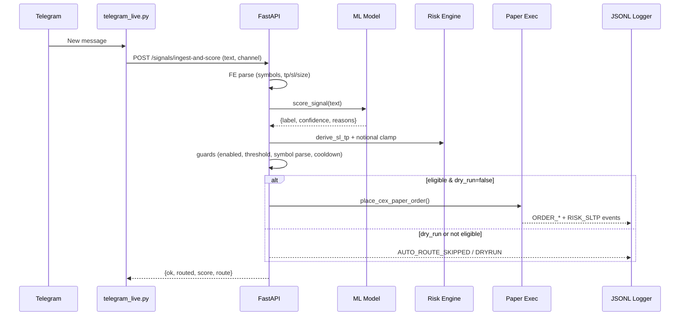

# LeviBot — Architecture

> Full-stack AI trading suite: Telegram → ML scoring → Risk → (autoroute/paper) → Observability  
> Version: v1.3.x

## 0) TL;DR
- **Backend**: FastAPI, modular routers, JSONL event log, Prometheus metrics
- **ML**: TF-IDF + LinearSVC (+ CalibratedClassifierCV), dataset pipeline, weekly retrain
- **Signals**: Rule+ML hybrid scoring, FE (TP/SL/size, multi-symbol), guard'lı autoroute
- **Exec**: CEX paper executor (ccxt), Risk++ (ATR policies, runtime switch)
- **Panel**: Vite+React+TS, Trades/Signals/Timeline + mini-cards & charts
- **Ops**: Redis RL, S3/MinIO archiver, Docker prod compose, CI, health/metrics

---

## 1) High-Level Component Diagram

```mermaid
flowchart LR
  TG[Telegram Channels] --> |Telethon| Ingest
  subgraph Backend (FastAPI)
    Ingest[telegram_live.py] --> Score[/ /signals/ingest-and-score /]
    Score --> FE[Feature Engineering]
    FE --> ML[ML Scorer]
    ML --> Risk[Risk Engine (Policy, ATR, Clamp)]
    Risk --> Guard[Guards (threshold, cooldown, symbol map)]
    Guard -->|dry-run| Log1[(JSONL)]
    Guard -->|execute| Exec[Paper Executor (ccxt)]
    Exec --> Log2[(JSONL)]
    Backend --> Prom[(Prometheus Metrics)]
  end
  Panel[Vite+React Panel] --> |HTTP| Backend
  Admin[(S3/MinIO)] <--> Archiver[ops/s3_archiver.py]
  Redis[(Redis)] <--> RL[Rate Limit Middleware]
```

---

## 2) Request/Message Flows

### 2.1 Telegram → Score → Autoroute (E2E)



---

## 3) Data & Events

### 3.1 Event Log (JSONL)

* **Path**: `backend/data/logs/YYYY-MM-DD/events-HH.jsonl`
* **Schema (generic)**:

  ```json
  {
    "ts": 1730805032.123,            // float unix
    "event_type": "SIGNAL_SCORED",   // enum
    "symbol": "BTCUSDT",             // optional
    "payload": { ... },              // masked PII
    "trace_id": "abc-123"            // optional correlation
  }
  ```
* **Key event types**: `SIGNAL_INGEST`, `SIGNAL_SCORED`, `AUTO_ROUTE_*`,
  `ORDER_NEW`, `ORDER_PARTIAL_FILL`, `ORDER_FILLED`, `RISK_SLTP`,
  `POSITION_CLOSED`, `DEX_QUOTE`, `NFT_FLOOR`, `L2_YIELDS`, `RISK_POLICY_CHANGED`.

### 3.2 Metrics (Prometheus)

* HTTP: `levibot_http_requests_total`, `levibot_http_request_latency_seconds`
* Events: `levibot_events_total{event_type=...}`
* TG live: `levibot_tg_reconnects_total`, `levibot_tg_last_*_ts`
* Build: `levibot_build_info{version,git_sha,branch} 1`
* Ready/Live: `/livez` & `/readyz` (eth RPC optional)

---

## 4) ML Layer

* **Model**: `TFIDF → LinearSVC → CalibratedClassifierCV(sigmoid)`
* **Labels**: `BUY | SELL | NO-TRADE`
* **Confidence**: probability-like (0–1), trust adjusted (`channel trust`)
* **Dataset**: `backend/data/signals/labels.jsonl` (+ append API, CLI)
* **Artifacts**: `backend/artifacts/signal_clf.joblib`, `metrics.json`
* **Retrain**: `ops/cron/retrain.sh` (weekly), Docker cron, make target

---

## 5) Risk++

* **Policies**: `conservative | moderate | aggressive`
* **SL/TP**: FE hint önceliği; yoksa ATR-based türetme
* **Clamp**: Notional min/max; runtime policy switch (`GET/PUT /risk/policy`)
* **Cooldown**: Symbol bazlı kısa süreli blok

---

## 6) Security

* **Auth**: `X-API-Key` (multi-key supported)
* **Rate-limit**: In-memory veya Redis token bucket (Lua, atomic)
* **PII Mask**: logger payload masking (api_key/secret/token/password/…)
* **CORS**: ENV ile yönetilir, panel origin allowlist

---

## 7) Panel (Frontend)

* **Pages**: Trades (events), Signals (form+threshold+policy switch+dataset append),
  Signals Timeline (history+filters+routed badge), mini-cards (DEX/NFT/L2),
  charts (sparkline + bar)
* **Fetch**: relative API paths (Nginx reverse proxy ile `/` domain)

---

## 8) Storage & Archival

* **JSONL** local → `.gz` compress → **S3/MinIO** upload (daily)
* **Prune**: `keep_days` sonrası eski dosyalar silinir
* **MinIO**: local dev için S3-compatible stack (9000/9001)

---

## 9) Directory Snapshot (kısa)

```
backend/
  src/app/main.py             # routers + lifespan + endpoints
  src/infra/{logger,metrics,sec,redis_rl,version}.py
  src/ml/{signal_model,ds_tools,retrain}.py
  src/signals/{scorer,fe,symbols}.py
  src/exec/{paper.py,paper_ccxt.py}
  src/core/risk.py
  src/ingest/{telegram_live.py,trust.py}
  tests/...
frontend/panel/src/...
ops/
  api.Dockerfile, panel.Dockerfile, nginx.conf
  docker-compose.prod.yml, minio-compose.yml
  cron/{retrain.sh, archive.sh}
  s3_archiver.py
docs/
  ARCHITECTURE.md, DEPLOYMENT.md  <-- (this file)
```

---

## 10) Known Limits / Next

* **Real exchanges**: şimdilik paper; gerçek alım satım bağlamadan önce vault/secrets + kademeli guard şart.
* **Model**: baseline; embeddings/ensemble/active learning ile güçlendirilebilir.
* **Panel**: realtime WS, daha zengin timeline & charts (nice-to-have).
