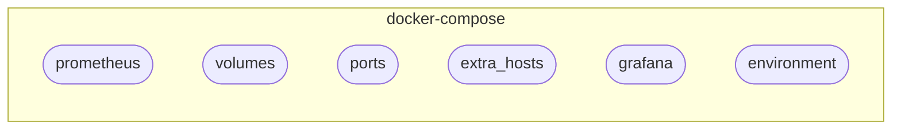
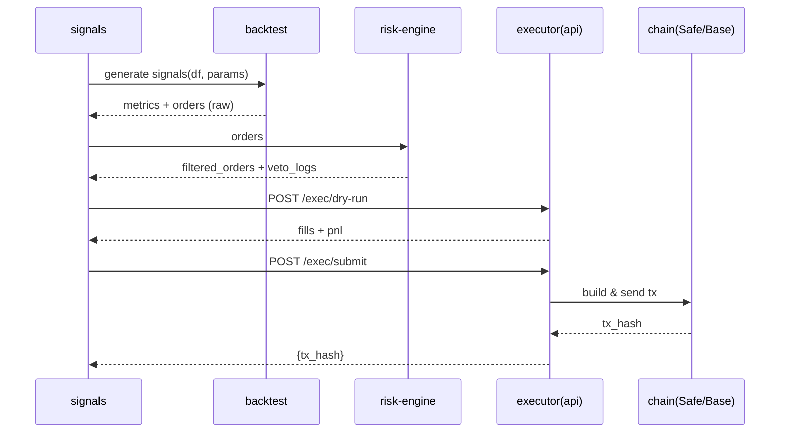

# LeviBot Architecture Report

- Repo: `/Users/onur/levibot`
- Files: **796**, Size: **12MB**
- Git HEAD: `e4bd1a7`

## Tree

```text
├── .github/
│   ├── ISSUE_TEMPLATE/
│   │   ├── bug_report.yml (3KB)
│   │   └── feature_request.yml (3KB)
│   ├── workflows/
│   │   ├── backend-ci.yml (2KB)
│   │   ├── ci.yml (6KB)
│   │   ├── frontend-ci.yml (2KB)
│   │   ├── nightly-backtest.yml (2KB)
│   │   ├── nightly.yml (4KB)
│   │   └── security.yml (1KB)
│   ├── dependabot.yml (468B)
│   └── PULL_REQUEST_TEMPLATE.md (2KB)
├── .ruff_cache/
│   ├── 0.14.0/
│   │   ├── 1216706825969344619 (238B)
│   │   ├── 12489317469684770350 (82B)
│   │   ├── 13025728756122374139 (817B)
│   │   ├── 13055530530707807627 (2KB)
│   │   ├── 13070585345537153452 (80B)
│   │   ├── 14068412364663271307 (130B)
│   │   ├── 15223087284823119331 (151B)
│   │   ├── 15952508815147766269 (80B)
│   │   ├── 1736770101353521058 (121B)
│   │   ├── 17828813535703125496 (91B)
│   │   ├── 18114073510620951682 (72B)
│   │   ├── 18170407188488752110 (90B)
│   │   ├── 2027994869316063337 (189B)
│   │   ├── 2221725735929353049 (126B)
│   │   ├── 3284867565259789547 (104B)
│   │   ├── 5767306018333447291 (66B)
│   │   ├── 7898717456353839128 (9KB)
│   │   └── 935884040094709090 (94B)
│   ├── .gitignore (35B)
│   └── CACHEDIR.TAG (43B)
├── .vscode/
│   ├── extensions.json (252B)
│   └── settings.json (765B)
├── apps/
│   ├── miniapp/
│   │   ├── src/
│   │   │   ├── index.css (5KB)
│   │   │   └── main.tsx (9KB)
│   │   ├── Dockerfile (609B)
│   │   ├── index.html (524B)
│   │   ├── package.json (835B)
│   │   ├── tsconfig.json (606B)
│   │   ├── tsconfig.node.json (214B)
│   │   └── vite.config.ts (243B)
│   └── telegram_bot.py (11KB)
├── assets/
│   └── README.txt (93B)
├── backend/
│   ├── backend/
│   ├── config/
│   │   └── risk_policy.yaml (209B)
│   ├── configs/
│   │   ├── features.yaml (309B)
│   │   ├── mev.yaml (200B)
│   │   ├── model.yaml (571B)
│   │   ├── nft.yaml (232B)
│   │   ├── onchain.yaml (435B)
│   │   ├── risk.yaml (655B)
│   │   ├── strategy.yaml (439B)
│   │   ├── symbols.yaml (511B)
│   │   ├── telegram.yaml (722B)
│   │   ├── users.yaml (1KB)
│   │   └── yields.yaml (356B)
│   ├── feature_store/
│   │   └── merge_sentiment.py (4KB)
│   ├── integrations/
│   │   ├── __init__.py (47B)
│   │   ├── telethon_backfill.py (2KB)
│   │   └── telethon_listener.py (7KB)
│   ├── lightning_logs/
│   │   └── version_0/
│   │       ├── hparams.yaml (53B)
│   │       └── metrics.csv (650B)
│   ├── ml/
│   │   ├── backtest/
│   │   │   ├── __init__.py (0B)
│   │   │   └── engine.py (3KB)
│   │   ├── feature_store/
│   │   │   ├── __init__.py (289B)
│   │   │   ├── engineer.py (9KB)
│   │   │   ├── ingest.py (7KB)
│   │   │   ├── ingest_multi.py (6KB)
│   │   │   └── store.py (7KB)
│   │   ├── models/
│   │   │   ├── __init__.py (230B)
│   │   │   ├── baseline.py (8KB)
│   │   │   ├── deep_tfm.py (4KB)
│   │   │   └── registry.py (5KB)
│   │   └── policy/
│   │       ├── __init__.py (406B)
│   │       └── adaptive_sizing.py (6KB)
│   ├── notebooks/
│   ├── ops/
│   │   └── models/
│   │       ├── meta.json (410B)
│   │       └── model.skops (911B)
│   ├── reports/
│   │   ├── backtests/
│   │   └── chaos/
│   │       └── latest/
│   │           └── summary.json (125B)
│   ├── scripts/
│   │   ├── backtest_rsi_macd.py (8KB)
│   │   ├── bench_tft_latency.py (2KB)
│   │   ├── calibrate_and_sweep.py (9KB)
│   │   ├── clean_anomalous_ticks.py (4KB)
│   │   ├── cron_setup.sh (1KB)
│   │   ├── diagnose_feed.py (6KB)
│   │   ├── drift_check.py (8KB)
│   │   ├── ensemble_tuner.py (8KB)
│   │   ├── evaluate_marathon.sh (7KB)
│   │   ├── go_live_checklist.sh (6KB)
│   │   ├── health_check.sh (761B)
│   │   ├── make_snapshot.py (7KB)
│   │   ├── prod_readiness_check.sh (4KB)
│   │   ├── promote_model.py (2KB)
│   │   ├── rollback_model.sh (2KB)
│   │   ├── seed_analytics.py (7KB)
│   │   ├── seed_test_data.sh (1013B)
│   │   ├── smoke_test.sh (2KB)
│   │   ├── start_canary_marathon.sh (5KB)
│   │   ├── telethon_quickstart.sh (1KB)
│   │   ├── test_mexc.sh (4KB)
│   │   ├── train_deep_tfm.py (8KB)
│   │   ├── train_linlogit.py (2KB)
│   │   ├── train_ml_model.py (4KB)
│   │   ├── train_prod_model.py (9KB)
│   │   ├── train_simple_model.py (3KB)
│   │   └── train_wf_calibrated.py (4KB)
│   ├── sql/
│   │   ├── 001_timescale_init.sql (3KB)
│   │   ├── 002_enterprise_schema.sql (10KB)
│   │   ├── 010_caggs.sql (2KB)
│   │   ├── 020_continuous_aggs.sql (2KB)
│   │   └── 020_trades_enrich.sql (755B)
│   ├── src/
│   │   ├── adapters/
│   │   │   ├── __init__.py (62B)
│   │   │   └── mexc_ccxt.py (3KB)
│   │   ├── ai/
│   │   │   ├── prompts/
│   │   │   │   └── trade_reason.py (418B)
│   │   │   ├── __init__.py (18B)
│   │   │   ├── features.py (4KB)
│   │   │   ├── features_v2.py (9KB)
│   │   │   ├── model_provider.py (5KB)
│   │   │   ├── openai_client.py (19KB)
│   │   │   └── prompts.py (1KB)
│   │   ├── alerts/
│   │   │   ├── __init__.py (15B)
│   │   │   ├── autotrigger.py (3KB)
│   │   │   ├── channels.py (6KB)
│   │   │   ├── notify.py (549B)
│   │   │   ├── queue.py (5KB)
│   │   │   └── rules.py (4KB)
│   │   ├── analytics/
│   │   │   ├── __init__.py (63B)
│   │   │   └── store.py (3KB)
│   │   ├── app/
│   │   │   ├── middleware/
│   │   │   │   ├── __init__.py (54B)
│   │   │   │   ├── audit.py (4KB)
│   │   │   │   ├── auth.py (4KB)
│   │   │   │   └── rate_limit.py (3KB)
│   │   │   ├── routers/
│   │   │   │   ├── __init__.py (14B)
│   │   │   │   ├── ai.py (5KB)
│   │   │   │   ├── ai.py.bak (7KB)
│   │   │   │   ├── ai_brain.py (3KB)
│   │   │   │   ├── ai_simple.py (8KB)
│   │   │   │   ├── alerts.py (4KB)
│   │   │   │   ├── analytics.py (945B)
│   │   │   │   ├── auth.py (2KB)
│   │   │   │   ├── automation.py (5KB)
│   │   │   │   ├── autotrade.py (7KB)
│   │   │   │   ├── backtest.py (2KB)
│   │   │   │   ├── engines.py (3KB)
│   │   │   │   ├── events.py (3KB)
│   │   │   │   ├── exchange.py (5KB)
│   │   │   │   ├── live.py (1KB)
│   │   │   │   ├── market_data.py (2KB)
│   │   │   │   ├── metrics.py (505B)
│   │   │   │   ├── ml.py (4KB)
│   │   │   │   ├── ml_deep.py (8KB)
│   │   │   │   ├── ml_predict.py (6KB)
│   │   │   │   ├── ops.py (1KB)
│   │   │   │   ├── paper.py (18KB)
│   │   │   │   ├── prices.py (3KB)
│   │   │   │   ├── risk.py (2KB)
│   │   │   │   ├── signal_log.py (1KB)
│   │   │   │   ├── stream.py (2KB)
│   │   │   │   ├── ta.py (12KB)
│   │   │   │   ├── ta.py.bak (4KB)
│   │   │   │   ├── ta_backup.py (20KB)
│   │   │   │   ├── ta_clean.py (12KB)
│   │   │   │   ├── ta_debug.py (12KB)
│   │   │   │   ├── ta_final.py (12KB)
│   │   │   │   ├── ta_new.py (11KB)
│   │   │   │   ├── ta_simple.py (8KB)
│   │   │   │   └── ta_working.py (12KB)
│   │   │   ├── routes/
│   │   │   │   ├── __init__.py (0B)
│   │   │   │   ├── admin.py (8KB)
│   │   │   │   ├── ai.py (5KB)
│   │   │   │   ├── analytics.py (11KB)
│   │   │   │   ├── auth.py (2KB)
│   │   │   │   ├── day.py (5KB)
│   │   │   │   ├── dev.py (4KB)
│   │   │   │   ├── feed.py (3KB)
│   │   │   │   ├── lse.py (8KB)
│   │   │   │   ├── ops.py (5KB)
│   │   │   │   ├── risk.py (11KB)
│   │   │   │   ├── rsi_macd.py (3KB)
│   │   │   │   ├── strategy.py (3KB)
│   │   │   │   ├── swing.py (5KB)
│   │   │   │   └── universe.py (6KB)
│   │   │   ├── __init__.py (0B)
│   │   │   ├── __main__.py (290B)
│   │   │   ├── admin.py (682B)
│   │   │   ├── ai_api.py (4KB)
│   │   │   ├── ai_twap_dca_api.py (2KB)
│   │   │   ├── config.py (800B)
│   │   │   ├── config_api.py (522B)
│   │   │   ├── exec_algo.py (1KB)
│   │   │   ├── exec_test.py (5KB)
│   │   │   ├── l2_farm_api.py (1KB)
│   │   │   ├── main.py (7KB)
│   │   │   ├── perp_breakout_api.py (1KB)
│   │   │   ├── reports.py (9KB)
│   │   │   ├── reports.py.backup (9KB)
│   │   │   ├── reports_new.py (2KB)
│   │   │   ├── reports_simple.py (2KB)
│   │   │   ├── schedule.py (4KB)
│   │   │   ├── schemas.py (685B)
│   │   │   ├── state.py (589B)
│   │   │   ├── telegram_api.py (4KB)
│   │   │   └── twap_rule_api.py (1KB)
│   │   ├── automation/
│   │   │   ├── __init__.py (0B)
│   │   │   ├── ai_trading_engine.py (14KB)
│   │   │   └── auto_trader.py (5KB)
│   │   ├── automl/
│   │   │   ├── __init__.py (343B)
│   │   │   ├── build_features.py (3KB)
│   │   │   ├── collect_data.py (2KB)
│   │   │   ├── evaluate.py (1KB)
│   │   │   ├── nightly_retrain.py (5KB)
│   │   │   ├── train_lgbm.py (3KB)
│   │   │   ├── train_tft.py (1KB)
│   │   │   └── versioning.py (3KB)
│   │   ├── backtest/
│   │   │   ├── __init__.py (281B)
│   │   │   ├── cli.py (9KB)
│   │   │   ├── engine.py (2KB)
│   │   │   ├── indicators.py (2KB)
│   │   │   ├── metrics.py (5KB)
│   │   │   ├── README_BACKTEST.md (4KB)
│   │   │   ├── report.py (12KB)
│   │   │   ├── runner.py (3KB)
│   │   │   ├── runner_v2.py (7KB)
│   │   │   └── strategies.py (4KB)
│   │   ├── core/
│   │   │   └── risk.py (4KB)
│   │   ├── datafeed/
│   │   │   ├── __init__.py (0B)
│   │   │   ├── collectors.py (844B)
│   │   │   └── metrics.py (687B)
│   │   ├── engine/
│   │   │   ├── __init__.py (473B)
│   │   │   ├── engine.py (15KB)
│   │   │   ├── health_monitor.py (4KB)
│   │   │   ├── manager.py (7KB)
│   │   │   ├── recovery.py (3KB)
│   │   │   └── registry.py (2KB)
│   │   ├── exchange/
│   │   │   ├── __init__.py (226B)
│   │   │   ├── executor.py (4KB)
│   │   │   ├── mexc_filters.py (11KB)
│   │   │   ├── mexc_orders.py (4KB)
│   │   │   └── portfolio.py (2KB)
│   │   ├── exec/
│   │   │   ├── __init__.py (615B)
│   │   │   ├── algo_base.py (750B)
│   │   │   ├── algo_binance.py (2KB)
│   │   │   ├── algo_bybit.py (709B)
│   │   │   ├── binance_sig.py (517B)
│   │   │   ├── mexc_ccxt.py (12KB)
│   │   │   ├── oco.py (632B)
│   │   │   ├── paper.py (1KB)
│   │   │   ├── paper_ccxt.py (4KB)
│   │   │   ├── paper_portfolio.py (14KB)
│   │   │   ├── precision.py (1KB)
│   │   │   ├── risk_engine.py (1KB)
│   │   │   ├── router.py (7KB)
│   │   │   ├── router_binance_algo_rest.py (3KB)
│   │   │   ├── sizing.py (2KB)
│   │   │   ├── state_store.py (898B)
│   │   │   ├── twap.py (2KB)
│   │   │   └── types.py (433B)
│   │   ├── features/
│   │   │   ├── __init__.py (0B)
│   │   │   ├── pipeline.py (409B)
│   │   │   ├── telegram.py (715B)
│   │   │   ├── telegram_bias.py (2KB)
│   │   │   └── telegram_pulse.py (2KB)
│   │   ├── ga/
│   │   │   ├── __init__.py (622B)
│   │   │   ├── api_router.py (11KB)
│   │   │   ├── features_adapter.py (7KB)
│   │   │   ├── fitness.py (9KB)
│   │   │   ├── ga_core.py (10KB)
│   │   │   ├── genes.py (4KB)
│   │   │   ├── label.py (4KB)
│   │   │   ├── runner.py (8KB)
│   │   │   └── wf.py (7KB)
│   │   ├── infra/
│   │   │   ├── archive.py (2KB)
│   │   │   ├── audit.py (947B)
│   │   │   ├── audit_log.py (10KB)
│   │   │   ├── auth.py (1KB)
│   │   │   ├── circuit_breaker.py (11KB)
│   │   │   ├── config_store.py (1KB)
│   │   │   ├── db.py (3KB)
│   │   │   ├── db_trades.py (3KB)
│   │   │   ├── duck.py (2KB)
│   │   │   ├── event_bus.py (8KB)
│   │   │   ├── flags_store.py (3KB)
│   │   │   ├── logger.py (2KB)
│   │   │   ├── market_context.py (2KB)
│   │   │   ├── metrics.py (10KB)
│   │   │   ├── ml_metrics.py (2KB)
│   │   │   ├── price_cache.py (7KB)
│   │   │   ├── redis_rl.py (2KB)
│   │   │   ├── redis_stream.py (4KB)
│   │   │   ├── sec.py (3KB)
│   │   │   ├── security.py (2KB)
│   │   │   ├── settings.py (4KB)
│   │   │   ├── telegram_alerts.py (4KB)
│   │   │   ├── version.py (1KB)
│   │   │   └── ws_bus.py (1KB)
│   │   ├── ingest/
│   │   │   ├── __init__.py (1B)
│   │   │   ├── telegram_live.py (4KB)
│   │   │   ├── telegram_signals.py (3KB)
│   │   │   └── trust.py (864B)
│   │   ├── l2/
│   │   │   ├── farm.py (4KB)
│   │   │   └── yields.py (328B)
│   │   ├── labeling/
│   │   │   ├── __init__.py (0B)
│   │   │   └── triple_barrier.py (1005B)
│   │   ├── market/
│   │   │   ├── __init__.py (49B)
│   │   │   ├── normalize.py (1KB)
│   │   │   └── ws_mexc.py (6KB)
│   │   ├── market_data/
│   │   │   ├── __init__.py (123B)
│   │   │   └── websocket_feed.py (5KB)
│   │   ├── metrics/
│   │   │   ├── __init__.py (702B)
│   │   │   └── metrics.py (3KB)
│   │   ├── mev/
│   │   │   ├── arb_scan.py (1KB)
│   │   │   ├── quote.py (2KB)
│   │   │   └── snapshot.py (721B)
│   │   ├── ml/
│   │   │   ├── bench/
│   │   │   │   ├── __init__.py (73B)
│   │   │   │   └── latency.py (2KB)
│   │   │   ├── ensemble/
│   │   │   │   ├── __init__.py (99B)
│   │   │   │   └── weights.py (5KB)
│   │   │   ├── features/
│   │   │   │   ├── __init__.py (447B)
│   │   │   │   ├── onchain_fetcher.py (4KB)
│   │   │   │   └── sentiment_extractor.py (4KB)
│   │   │   ├── models/
│   │   │   │   ├── __init__.py (216B)
│   │   │   │   └── ensemble_predictor.py (6KB)
│   │   │   ├── policy/
│   │   │   │   └── adaptive_bridge.py (2KB)
│   │   │   ├── postproc/
│   │   │   │   ├── __init__.py (68B)
│   │   │   │   └── calibration.py (3KB)
│   │   │   ├── tft/
│   │   │   │   ├── __init__.py (237B)
│   │   │   │   ├── dataset.py (2KB)
│   │   │   │   ├── drift.py (7KB)
│   │   │   │   ├── infer_tft.py (4KB)
│   │   │   │   ├── model.py (2KB)
│   │   │   │   ├── README_TFT.md (6KB)
│   │   │   │   └── train_tft_prod.py (14KB)
│   │   │   ├── utils/
│   │   │   │   ├── __init__.py (165B)
│   │   │   │   ├── cache.py (2KB)
│   │   │   │   └── rate_limit.py (2KB)
│   │   │   ├── __init__.py (68B)
│   │   │   ├── ds_tools.py (2KB)
│   │   │   ├── feature_store.py (10KB)
│   │   │   ├── infer_lgbm.py (2KB)
│   │   │   ├── model_card_schema.json (4KB)
│   │   │   ├── model_pipeline.py (12KB)
│   │   │   ├── README_TRAINING.md (6KB)
│   │   │   ├── retrain.py (645B)
│   │   │   ├── shadow.py (4KB)
│   │   │   ├── signal_model.py (3KB)
│   │   │   └── train_lgbm_prod.py (15KB)
│   │   ├── models/
│   │   │   ├── __init__.py (0B)
│   │   │   └── xgb_model.py (819B)
│   │   ├── news/
│   │   │   ├── __init__.py (0B)
│   │   │   ├── cache.py (676B)
│   │   │   ├── llm_scorer.py (2KB)
│   │   │   ├── rss_ingest.py (1KB)
│   │   │   └── score_openai.py (4KB)
│   │   ├── nft/
│   │   │   ├── floor.py (1KB)
│   │   │   ├── sniper.py (2KB)
│   │   │   └── traits.py (1KB)
│   │   ├── onchain/
│   │   │   ├── listener.py (2KB)
│   │   │   └── pricing.py (1KB)
│   │   ├── ops/
│   │   │   ├── __init__.py (55B)
│   │   │   ├── replay.py (2KB)
│   │   │   └── s3_archiver.py (4KB)
│   │   ├── orchestrator/
│   │   │   └── strategy_orchestrator.py (11KB)
│   │   ├── realtime/
│   │   │   ├── __init__.py (43B)
│   │   │   ├── dispatcher.py (2KB)
│   │   │   └── schemas.py (1KB)
│   │   ├── reports/
│   │   │   ├── telegram_eval.py (4KB)
│   │   │   └── telegram_reputation.py (2KB)
│   │   ├── risk/
│   │   │   ├── __init__.py (278B)
│   │   │   ├── dd_tracker.py (574B)
│   │   │   ├── guard.py (2KB)
│   │   │   ├── manager.py (8KB)
│   │   │   └── policy.py (2KB)
│   │   ├── services/
│   │   │   ├── __init__.py (0B)
│   │   │   └── market_data_service.py (5KB)
│   │   ├── signals/
│   │   │   ├── __init__.py (0B)
│   │   │   ├── baseline.py (1KB)
│   │   │   ├── fe.py (2KB)
│   │   │   ├── hybrid.py (5KB)
│   │   │   ├── ml_model.py (2KB)
│   │   │   ├── scorer.py (1KB)
│   │   │   ├── symbols.py (1KB)
│   │   │   └── trend.py (1KB)
│   │   ├── store/
│   │   │   └── clickhouse_client.py (13KB)
│   │   ├── strategies/
│   │   │   ├── day/
│   │   │   │   ├── __init__.py (22B)
│   │   │   │   ├── config.py (1KB)
│   │   │   │   ├── engine.py (5KB)
│   │   │   │   └── features.py (5KB)
│   │   │   ├── db/
│   │   │   │   ├── __init__.py (119B)
│   │   │   │   └── trades_repo.py (8KB)
│   │   │   ├── lse/
│   │   │   │   ├── config.py (1KB)
│   │   │   │   ├── engine.py (12KB)
│   │   │   │   ├── executor.py (7KB)
│   │   │   │   ├── features.py (3KB)
│   │   │   │   ├── guards.py (4KB)
│   │   │   │   └── price_guards.py (3KB)
│   │   │   ├── rsi_macd/
│   │   │   │   ├── __init__.py (760B)
│   │   │   │   ├── config.py (6KB)
│   │   │   │   ├── engine.py (13KB)
│   │   │   │   └── features.py (7KB)
│   │   │   ├── swing/
│   │   │   │   ├── __init__.py (19B)
│   │   │   │   ├── config.py (1KB)
│   │   │   │   ├── engine.py (5KB)
│   │   │   │   └── features.py (554B)
│   │   │   ├── __init__.py (532B)
│   │   │   ├── base.py (753B)
│   │   │   └── policy_engine.py (14KB)
│   │   ├── strategy/
│   │   │   ├── ai_twap_dca.py (10KB)
│   │   │   ├── perp_breakout.py (8KB)
│   │   │   └── twap_rule_bot.py (8KB)
│   │   ├── telegram/
│   │   │   ├── __init__.py (0B)
│   │   │   └── bot.py (2KB)
│   │   ├── testing/
│   │   │   ├── __init__.py (36B)
│   │   │   └── seed_data.py (11KB)
│   │   ├── trading/
│   │   │   ├── __init__.py (42B)
│   │   │   ├── paper_engine_rt.py (8KB)
│   │   │   ├── risk_guard.py (1KB)
│   │   │   └── slippage.py (1KB)
│   │   ├── universe/
│   │   │   ├── __init__.py (0B)
│   │   │   └── topvol.py (4KB)
│   │   └── __init__.py (0B)
│   ├── strategies/
│   │   ├── base/
│   │   │   ├── __init__.py (0B)
│   │   │   └── interface.py (1KB)
│   │   ├── day/
│   │   ├── lse/
│   │   │   ├── __init__.py (102B)
│   │   │   └── config.py (3KB)
│   │   ├── swing/
│   │   └── __init__.py (953B)
│   ├── tests/
│   │   ├── e2e/
│   │   │   ├── __init__.py (20B)
│   │   │   ├── conftest.py (2KB)
│   │   │   ├── test_paper_order_path.py (616B)
│   │   │   └── test_signals_flow.py (2KB)
│   │   ├── integration/
│   │   │   └── test_rsi_macd_smoke.py (7KB)
│   │   ├── test_backtest/
│   │   │   ├── __init__.py (23B)
│   │   │   ├── test_metrics.py (2KB)
│   │   │   └── test_runner.py (2KB)
│   │   ├── test_chaos/
│   │   │   ├── __init__.py (32B)
│   │   │   ├── test_chaos_recovery.py (3KB)
│   │   │   └── test_kill_switch.py (3KB)
│   │   ├── test_ml/
│   │   │   ├── __init__.py (17B)
│   │   │   ├── test_drift_metrics.py (2KB)
│   │   │   ├── test_ensemble_weights.py (1KB)
│   │   │   └── test_tft_latency.py (1KB)
│   │   ├── conftest.py (780B)
│   │   ├── test_alert_api.py (6KB)
│   │   ├── test_alert_channels.py (3KB)
│   │   ├── test_alert_queue.py (2KB)
│   │   ├── test_alert_rules.py (1KB)
│   │   ├── test_analytics_basic.py (608B)
│   │   ├── test_analytics_pack.py (2KB)
│   │   ├── test_auto_route.py (2KB)
│   │   ├── test_auto_route_multi.py (1KB)
│   │   ├── test_automl_nightly.py (6KB)
│   │   ├── test_backtest_smoke.py (3KB)
│   │   ├── test_cex_paper_exec.py (2KB)
│   │   ├── test_engine_smoke.py (2KB)
│   │   ├── test_events_filters.py (6KB)
│   │   ├── test_fe_parser.py (1013B)
│   │   ├── test_feature_store_leakage.py (1KB)
│   │   ├── test_gap_filler.py (1KB)
│   │   ├── test_health_ready.py (344B)
│   │   ├── test_infer_lgbm_wrapper.py (725B)
│   │   ├── test_integrated_feeder_engine.py (2KB)
│   │   ├── test_kill_switch.py (3KB)
│   │   ├── test_l2_yields.py (484B)
│   │   ├── test_leakage_guards.py (7KB)
│   │   ├── test_lifespan_smoke.py (669B)
│   │   ├── test_manager_smoke.py (2KB)
│   │   ├── test_market_feeder.py (1KB)
│   │   ├── test_mev_quote_tri.py (782B)
│   │   ├── test_mexc_adapter.py (728B)
│   │   ├── test_ml_components.py (5KB)
│   │   ├── test_model_pack.py (4KB)
│   │   ├── test_nft_floor_plan.py (474B)
│   │   ├── test_notional_clamp.py (601B)
│   │   ├── test_order_idempotency.py (2KB)
│   │   ├── test_paper_exec.py (2KB)
│   │   ├── test_performance.py (2KB)
│   │   ├── test_policy_effect_on_sltp.py (971B)
│   │   ├── test_realtime_health.py (2KB)
│   │   ├── test_realtime_smoke.py (5KB)
│   │   ├── test_recovery_policy.py (2KB)
│   │   ├── test_redis_rl.py (2KB)
│   │   ├── test_risk_engine.py (684B)
│   │   ├── test_risk_manager.py (5KB)
│   │   ├── test_risk_policy.py (896B)
│   │   ├── test_risk_policy_runtime.py (1KB)
│   │   ├── test_risk_preview.py (358B)
│   │   ├── test_security.py (1KB)
│   │   ├── test_security_pack.py (3KB)
│   │   ├── test_signal_score.py (643B)
│   │   ├── test_smoke.py (463B)
│   │   ├── test_tft_dataset_smoke.py (792B)
│   │   ├── test_tft_train_smoke.py (926B)
│   │   ├── test_train_lgbm_prod_smoke.py (1KB)
│   │   ├── test_trust_adjust.py (422B)
│   │   └── test_version_metric.py (1KB)
│   ├── wallets/
│   │   └── wallet_01.json (118B)
│   ├── env.prod.example (4KB)
│   ├── requirements-dev.txt (289B)
│   ├── requirements.txt (1KB)
│   └── test_ccxt_symbols.py (428B)
├── configs/
│   ├── alerts.yaml (919B)
│   ├── day.yaml (585B)
│   ├── feed.yaml (3KB)
│   ├── flags.yaml (1KB)
│   ├── lse.panic.yaml (1KB)
│   ├── lse.prod.yaml (1KB)
│   ├── lse.yaml (858B)
│   ├── rsi_macd.day.yaml (786B)
│   ├── rsi_macd.scalp.yaml (876B)
│   ├── rsi_macd.swing.yaml (896B)
│   ├── swing.yaml (697B)
│   └── universe.yaml (3KB)
├── docker/
│   ├── app.Dockerfile (918B)
│   ├── bot.Dockerfile (839B)
│   ├── cron.Dockerfile (997B)
│   └── panel.Dockerfile (1KB)
├── docs/
│   ├── go-live/
│   │   ├── CHECKPOINT_REPORT_TEMPLATE.md (2KB)
│   │   ├── GO_NO_GO_TEMPLATE.md (6KB)
│   │   ├── PRODUCTION_TRANSITION_PLAN.md (6KB)
│   │   └── SLO_DASHBOARD_GUIDE.md (6KB)
│   ├── runbooks/
│   │   └── CHAOS_RUNBOOK.md (6KB)
│   ├── AI_TRADING.md (8KB)
│   ├── ARCHITECTURE.md (5KB)
│   ├── architecture_report.md (55KB)
│   ├── CANARY_STAGE2_SUCCESS.md (4KB)
│   ├── CANARY_STARTED.md (5KB)
│   ├── CONTRIBUTING.md (8KB)
│   ├── DEPLOYMENT.md (3KB)
│   ├── DEPLOYMENT_GUIDE.md (12KB)
│   ├── DEVELOPMENT_PLAN_SUMMARY.md (9KB)
│   ├── DEVELOPMENT_ROADMAP.md (32KB)
│   ├── DOCKER_QUICKSTART.md (3KB)
│   ├── ENTERPRISE_SETUP_COMPLETE.md (8KB)
│   ├── ENV.md (1KB)
│   ├── FULL_PACKAGE_COMPLETE.md (7KB)
│   ├── GENERAL.md (6KB)
│   ├── GO_LIVE_GUIDE.md (9KB)
│   ├── GO_LIVE_PLAYBOOK.md (5KB)
│   ├── GUARDRAILS_CANARY.md (9KB)
│   ├── GUARDRAILS_QUICKSTART.md (3KB)
│   ├── KEY_ROTATION_INCIDENT.md (6KB)
│   ├── MEXC_INTEGRATION.md (9KB)
│   ├── MEXC_SETUP.md (8KB)
│   ├── ML_SPRINT1_GUIDE.md (7KB)
│   ├── ML_SPRINT2_GUIDE.md (11KB)
│   ├── ML_SPRINT3_GUIDE.md (10KB)
│   ├── MULTI_SYMBOL_UNIVERSE.md (9KB)
│   ├── PANEL_SETUP.md (2KB)
│   ├── PANIC_MODE.md (5KB)
│   ├── PERFORMANCE.md (2KB)
│   ├── PLANNING_INDEX.md (12KB)
│   ├── POST_FIX_VALIDATION.md (5KB)
│   ├── PREFLIGHT_CHECKLIST.md (9KB)
│   ├── PROD_ML_SETUP.md (9KB)
│   ├── PRODUCTION_READY.md (6KB)
│   ├── PRODUCTION_RUNBOOK.md (7KB)
│   ├── QUICKSTART.md (6KB)
│   ├── REALTIME_IMPLEMENTATION.md (12KB)
│   ├── RELEASE_NOTES_v1.0.0.md (8KB)
│   ├── RELEASE_NOTES_v1.1.0.md (2KB)
│   ├── RELEASE_NOTES_v1.2.0.md (4KB)
│   ├── RELEASE_NOTES_v1.3.0.md (3KB)
│   ├── RELEASE_NOTES_v1.4.0.md (4KB)
│   ├── RELEASE_NOTES_v1.5.0.md (5KB)
│   ├── RELEASE_NOTES_v1.6.0.md (5KB)
│   ├── RELEASE_NOTES_v1.6.1.md (6KB)
│   ├── ROADMAP.md (9KB)
│   ├── ROADMAP_SUMMARY.md (8KB)
│   ├── RSI_MACD_STRATEGY.md (8KB)
│   ├── RUN.md (4KB)
│   ├── RUNBOOK_PROD.md (9KB)
│   ├── RUNBOOK_REALTIME.md (9KB)
│   ├── SECRETS_AUDIT.md (6KB)
│   ├── SECURITY.md (1KB)
│   ├── SECURITY_CHECKLIST.md (6KB)
│   ├── SECURITY_HARDENING_COMPLETE.md (6KB)
│   ├── SPRINT_PLANNING.md (21KB)
│   ├── STAGE3_PRODUCTION.md (5KB)
│   ├── TECHNICAL_EVOLUTION.md (18KB)
│   ├── TELEGRAM.md (4KB)
│   ├── TELETHON_SETUP.md (6KB)
│   └── WEB_PANEL_AUDIT.md (20KB)
├── frontend/
│   └── panel/
│       ├── src/
│       │   ├── components/
│       │   │   ├── ai/
│       │   │   │   ├── AIExplainerModal.tsx (5KB)
│       │   │   │   ├── AIImpactTicker.tsx (4KB)
│       │   │   │   └── AIRegimeCard.tsx (4KB)
│       │   │   ├── ml/
│       │   │   │   ├── ControlBar.tsx (3KB)
│       │   │   │   ├── KpiCard.tsx (1KB)
│       │   │   │   ├── SignalCard.tsx (2KB)
│       │   │   │   └── StatusBanner.tsx (2KB)
│       │   │   ├── ui/
│       │   │   │   ├── ErrorBoundary.tsx (1KB)
│       │   │   │   └── Skeleton.tsx (267B)
│       │   │   ├── AddToDataset.tsx (1KB)
│       │   │   ├── AIPredictions.tsx (9KB)
│       │   │   ├── AIStatus.tsx (7KB)
│       │   │   ├── BollingerBandsCard.tsx (6KB)
│       │   │   ├── BurstBanner.tsx (1KB)
│       │   │   ├── DarkModeToggle.tsx (694B)
│       │   │   ├── DateRange.tsx (2KB)
│       │   │   ├── DEXQuoteCard.tsx (2KB)
│       │   │   ├── DEXSparkline.tsx (2KB)
│       │   │   ├── FibonacciCard.tsx (6KB)
│       │   │   ├── L2YieldsBar.tsx (2KB)
│       │   │   ├── L2YieldsCard.tsx (2KB)
│       │   │   ├── MACDCard.tsx (5KB)
│       │   │   ├── NFTFloorCard.tsx (2KB)
│       │   │   ├── ReplayBadge.tsx (802B)
│       │   │   ├── RSICard.tsx (4KB)
│       │   │   ├── Sidebar.tsx (8KB)
│       │   │   ├── SSEStatus.tsx (2KB)
│       │   │   └── TradeWidget.tsx (6KB)
│       │   ├── lib/
│       │   │   ├── api.ts (16KB)
│       │   │   ├── download.ts (267B)
│       │   │   ├── mlApi.ts (3KB)
│       │   │   ├── prometheus.ts (2KB)
│       │   │   ├── sse.ts (2KB)
│       │   │   └── ws.ts (1KB)
│       │   ├── pages/
│       │   │   ├── AIBrain.tsx (11KB)
│       │   │   ├── Alerts.tsx (7KB)
│       │   │   ├── Analytics.tsx (11KB)
│       │   │   ├── AnalyticsDeciles.tsx (9KB)
│       │   │   ├── BacktestRunner.tsx (13KB)
│       │   │   ├── Daytrade.tsx (16KB)
│       │   │   ├── EnginesManager.tsx (10KB)
│       │   │   ├── EventsTimeline.tsx (12KB)
│       │   │   ├── Integrations.tsx (8KB)
│       │   │   ├── MEVFeed.tsx (5KB)
│       │   │   ├── MLDashboard.tsx (13KB)
│       │   │   ├── NFTSniper.tsx (3KB)
│       │   │   ├── OnChain.tsx (2KB)
│       │   │   ├── Ops.tsx (13KB)
│       │   │   ├── Overview.tsx (14KB)
│       │   │   ├── Paper.tsx (17KB)
│       │   │   ├── PaperTrading.tsx (16KB)
│       │   │   ├── Risk.tsx (16KB)
│       │   │   ├── RsiMacd.tsx (16KB)
│       │   │   ├── Scalp.tsx (16KB)
│       │   │   ├── Signals.tsx (6KB)
│       │   │   ├── SignalsTimeline.tsx (9KB)
│       │   │   ├── Strategies.tsx (5KB)
│       │   │   ├── Swing.tsx (16KB)
│       │   │   ├── TechnicalAnalysis.tsx (14KB)
│       │   │   ├── TelegramControl.tsx (8KB)
│       │   │   ├── TelegramInsights.tsx (6KB)
│       │   │   ├── TelegramSettings.tsx (3KB)
│       │   │   ├── TelegramSignals.tsx (8KB)
│       │   │   ├── Trades.tsx (7KB)
│       │   │   └── Watchlist.tsx (5KB)
│       │   ├── api.ts (6KB)
│       │   ├── App.tsx (4KB)
│       │   ├── index.css (118B)
│       │   ├── main.tsx (315B)
│       │   └── types.ts (979B)
│       ├── .env.development.local (36B)
│       ├── .env.example (221B)
│       ├── .env.local (221B)
│       ├── BUG_BASH_CHECKLIST.md (6KB)
│       ├── Dockerfile (527B)
│       ├── index.html (304B)
│       ├── Makefile (1KB)
│       ├── package-lock.json (120KB)
│       ├── package.json (633B)
│       ├── postcss.config.js (82B)
│       ├── QUICK_SMOKE.md (3KB)
│       ├── SMOKE_TEST_CHECKLIST.md (7KB)
│       ├── tailwind.config.js (177B)
│       ├── tsconfig.json (435B)
│       ├── tsconfig.node.json (215B)
│       └── vite.config.ts (244B)
├── ops/
│   ├── config-snapshots/
│   │   ├── flags_1760095957.json (651B)
│   │   ├── flags_1760120240.json (897B)
│   │   ├── flags_1760153218.json (1KB)
│   │   ├── flags_1760156382.json (1KB)
│   │   └── flags_1760161745.json (1KB)
│   ├── cron/
│   │   ├── archive.sh (284B)
│   │   └── retrain.sh (280B)
│   ├── grafana/
│   │   ├── dashboards/
│   │   │   ├── levibot-dashboard.json (1KB)
│   │   │   ├── ml_health.json (3KB)
│   │   │   ├── ml_production.json (6KB)
│   │   │   └── realtime_ops.json (12KB)
│   │   ├── datasources/
│   │   ├── provisioning/
│   │   │   └── dashboards/
│   │   │       └── levibot.yml (144B)
│   │   └── README.md (5KB)
│   ├── health/
│   │   └── panel.healthcheck.sh (341B)
│   ├── models/
│   │   └── model.skops (911B)
│   ├── prometheus/
│   │   ├── alerts.yml (8KB)
│   │   ├── ml_rules.yml (4KB)
│   │   ├── prometheus.yml (183B)
│   │   └── rules.yml (7KB)
│   ├── api.Dockerfile (829B)
│   ├── audit.log (5KB)
│   ├── Caddyfile (2KB)
│   ├── docker-compose-cron.yml (796B)
│   ├── docker-compose.yml (615B)
│   ├── grafana-dashboard.json (10KB)
│   ├── minio-compose.yml (1KB)
│   ├── nginx-https.conf.example (4KB)
│   ├── nginx.conf (4KB)
│   ├── panel.Dockerfile (347B)
│   └── prometheus.yml (420B)
├── reports/
│   └── soak/
│       └── README.md (1KB)
├── scripts/
│   ├── auto_recover.sh (3KB)
│   ├── auto_refresh_data.sh (135B)
│   ├── backup_daily.sh (2KB)
│   ├── canary_check.sh (747B)
│   ├── canary_stage2_test.sh (3KB)
│   ├── db_backup.sh (1KB)
│   ├── deploy.sh (6KB)
│   ├── emergency_controls.sh (3KB)
│   ├── git_snapshot.sh (1KB)
│   ├── go_live_checklist.sh (3KB)
│   ├── health_monitor.sh (4KB)
│   ├── keep_data_fresh.sh (638B)
│   ├── mock_soak.py (5KB)
│   ├── monitor_stage3.sh (978B)
│   ├── nightly_cron.sh (730B)
│   ├── replay_24h.py (7KB)
│   ├── rollback.sh (2KB)
│   ├── run_chaos_suite.sh (4KB)
│   ├── setup_cron.sh (2KB)
│   ├── setup_logrotate.sh (1KB)
│   ├── smoke_test.sh (5KB)
│   ├── smoke_test_integration.sh (9KB)
│   ├── snapshot_flags.py (2KB)
│   ├── soak_test.py (11KB)
│   ├── start_soak_test.sh (4KB)
│   ├── test_kill_switch.sh (3KB)
│   ├── validate_realtime.py (8KB)
│   └── verify_post_fix.py (5KB)
├── sprint/
│   ├── check_progress.sh (3KB)
│   ├── EPIC1_COMPLETION_SUMMARY.md (8KB)
│   ├── EPIC1_ENGINE_MANAGER_GUIDE.md (30KB)
│   ├── EPIC1_QUICKSTART.md (10KB)
│   ├── EPIC2_AI_FUSION_COMPLETE.md (9KB)
│   ├── EPIC3_RISK_MANAGER_COMPLETE.md (9KB)
│   ├── EPIC4_CICD_COMPLETE.md (11KB)
│   ├── EPIC5_AUTOML_COMPLETE.md (10KB)
│   ├── EPIC_A_CCXT_COMPLETE.md (7KB)
│   ├── EPIC_A_CCXT_GUIDE.md (13KB)
│   ├── EPIC_B_LGBM_COMPLETE.md (4KB)
│   ├── EPIC_B_LGBM_GUIDE.md (8KB)
│   ├── EPIC_C_TFT_COMPLETE.md (5KB)
│   ├── EPIC_D_BACKTEST_COMPLETE.md (6KB)
│   ├── EPIC_D_BACKTEST_GUIDE.md (8KB)
│   ├── EPIC_E_LIVE_PREP_COMPLETE.md (7KB)
│   ├── EPIC_E_LIVE_PREP_GUIDE.md (9KB)
│   ├── MONITORING_QUICKSTART.md (7KB)
│   ├── PR6_PR7_48H_PLAN.md (17KB)
│   ├── S10_TASKS.yaml (11KB)
│   ├── S10_THE_REAL_DEAL_PLAN.md (4KB)
│   ├── S9_GEMMA_FUSION_PLAN.md (19KB)
│   ├── S9_TASKS.yaml (14KB)
│   ├── SMOKE_TEST_RESULTS.md (7KB)
│   ├── SOAK_TEST_RESULTS.md (6KB)
│   ├── SPRINT10_COMPLETION_REPORT.md (16KB)
│   ├── SPRINT9_COMPLETION_FINAL.md (13KB)
│   ├── SPRINT9_FINAL_CHECKPOINT.md (13KB)
│   └── SPRINT9_MID_CHECKPOINT.md (10KB)
├── telegram/
│   ├── config.py (907B)
│   ├── registry.py (1KB)
│   ├── signal_parser.py (1KB)
│   └── user_client.py (4KB)
├── tests/
│   └── integration/
│       └── test_engines_smoke.py (4KB)
├── tools/
│   └── levibot_cursor.py (16KB)
├── .admin_key_info.txt (553B)
├── .dockerignore (453B)
├── .editorconfig (304B)
├── .env (4KB)
├── .env.docker (4KB)
├── .env.docker.bak (3KB)
├── .env.docker.bak2 (2KB)
├── .env.docker.example (2KB)
├── .env.example (436B)
├── .env.prod.example (2KB)
├── .gitignore (1KB)
├── .pre-commit-config.yaml (671B)
├── .ruff.toml (132B)
├── __init__.py (15B)
├── architecture_report.md (8MB)
├── cookies.txt (131B)
├── DEPLOY_READY_SUMMARY.md (8KB)
├── DEVELOPMENT_PLAN.md (14KB)
├── docker-compose.dev.yml (3KB)
├── docker-compose.enterprise.yml (7KB)
├── docker-compose.prod.yml (3KB)
├── docker-compose.yml (4KB)
├── Dockerfile.api (2KB)
├── Dockerfile.panel (1KB)
├── ENV.example (2KB)
├── ENV.levibot.example (2KB)
├── env.realtime.example (2KB)
├── GO_LIVE_PLAN.md (9KB)
├── INTEGRATION_SUMMARY.md (5KB)
├── LICENSE (1KB)
├── Makefile (5KB)
├── PR_SUMMARY.md (7KB)
├── pyproject.toml (2KB)
├── pytest.ini (128B)
├── README.md (60KB)
├── README_DOCKER.md (10KB)
├── README_PRODUCTION.md (10KB)
└── REALTIME_FILES.txt (3KB)
```

## Python Import Graph (top edges)

```mermaid
graph TD
  "main.py" --> "routers"
  "test_realtime_smoke.py" --> "backend"
  "test_engines_smoke.py" --> "backend"
  "test_automl_nightly.py" --> "src"
  "admin.py" --> "infra"
  "test_ml_components.py" --> "src"
  "ta_backup.py" --> "random"
  "engine.py" --> "features"
  "config.py" --> "dataclasses"
  "engine.py" --> "numpy"
  "config.py" --> "typing"
  "ai.py" --> "infra"
  "risk.py" --> "infra"
  "engine.py" --> "time"
  "signal_model.py" --> "sklearn"
  "twap_rule_bot.py" --> "exec"
  "test_rsi_macd_smoke.py" --> "src"
  "train_deep_tfm.py" --> "torch"
  "auth.py" --> "fastapi"
  "ta_new.py" --> "random"
  "paper.py" --> "infra"
  "analytics.py" --> "infra"
  "features.py" --> "numpy"
  "engine.py" --> "threading"
  "engine.py" --> "config"
  "telegram_signals.py" --> "aiogram"
  "cli.py" --> "backend"
  "paper_engine_rt.py" --> "infra"
  "__init__.py" --> "typing"
  "test_rsi_macd_smoke.py" --> "httpx"
  "telethon_listener.py" --> "telethon"
  "registry.py" --> "json"
  "train_ml_model.py" --> "ml"
  "train_linlogit.py" --> "sklearn"
  "train_wf_calibrated.py" --> "sklearn"
  "train_prod_model.py" --> "sklearn"
  "make_snapshot.py" --> "backend"
  "metrics.py" --> "prometheus_client"
  "reports_simple.py" --> "fastapi"
  "reports_new.py" --> "fastapi"
  "reports.py" --> "fastapi"
  "auth.py" --> "typing"
  "ta_final.py" --> "random"
  "ta_clean.py" --> "random"
  "ai.py" --> "fastapi"
  "ta_simple.py" --> "random"
  "ml.py" --> "infra"
  "market_data.py" --> "services"
  "ta_debug.py" --> "random"
  "ta_working.py" --> "random"
  "ta.py" --> "random"
  "auth.py" --> "infra"
  "swing.py" --> "strategies"
  "lse.py" --> "strategies"
  "strategy.py" --> "infra"
  "day.py" --> "strategies"
  "engine.py" --> "base"
  "engine.py" --> "db"
  "mexc_ccxt.py" --> "ccxt"
  "train_lgbm_prod.py" --> "backend"
```

## FastAPI / Router Endpoints (best-effort)

| File | Method | Path |
|---|---|---|
| `admin.py` | `GET` | `/ai_reason/status` |
| `admin.py` | `GET` | `/flags` |
| `admin.py` | `GET` | `/health` |
| `admin.py` | `POST` | `/admin/recompute-telegram` |
| `admin.py` | `POST` | `/ai_reason/{state}` |
| `admin.py` | `POST` | `/canary/{state}` |
| `admin.py` | `POST` | `/flags` |
| `admin.py` | `POST` | `/kill` |
| `admin.py` | `POST` | `/set-flag` |
| `admin.py` | `POST` | `/unkill` |
| `ai.py` | `GET` | `/health` |
| `ai.py` | `GET` | `/models` |
| `ai.py` | `GET` | `/models` |
| `ai.py` | `GET` | `/predict` |
| `ai.py` | `GET` | `/predict` |
| `ai.py` | `GET` | `/simple` |
| `ai.py` | `GET` | `/test` |
| `ai.py` | `POST` | `/select` |
| `ai.py` | `POST` | `/select` |
| `ai_api.py` | `POST` | `/ai/anomaly/explain` |
| `ai_api.py` | `POST` | `/ai/news/score` |
| `ai_api.py` | `POST` | `/ai/news/score-batch` |
| `ai_api.py` | `POST` | `/ai/regime/advice` |
| `ai_brain.py` | `GET` | `/status` |
| `ai_brain.py` | `POST` | `/explain` |
| `ai_brain.py` | `POST` | `/regime` |
| `ai_brain.py` | `POST` | `/score_news` |
| `ai_simple.py` | `GET` | `/models` |
| `ai_simple.py` | `GET` | `/predict` |
| `ai_simple.py` | `GET` | `/quick` |
| `ai_simple.py` | `GET` | `/test` |
| `ai_simple.py` | `POST` | `/select` |
| `ai_twap_dca_api.py` | `GET` | `/strategy/ai-twap-dca/status` |
| `ai_twap_dca_api.py` | `POST` | `/strategy/ai-twap-dca/cancel` |
| `ai_twap_dca_api.py` | `POST` | `/strategy/ai-twap-dca/start` |
| `alerts.py` | `GET` | `/history` |
| `alerts.py` | `POST` | `/trigger` |
| `analytics.py` | `GET` | `/deciles` |
| `analytics.py` | `GET` | `/performance` |
| `analytics.py` | `GET` | `/pnl/by_strategy` |
| `analytics.py` | `GET` | `/predictions/recent` |
| `analytics.py` | `GET` | `/predictions/recent` |
| `analytics.py` | `GET` | `/predictions/recent` |
| `analytics.py` | `GET` | `/trades/export.csv` |
| `analytics.py` | `GET` | `/trades/recent` |
| `api_router.py` | `DELETE` | `/jobs/{job_id}` |
| `api_router.py` | `GET` | `/best` |
| `api_router.py` | `GET` | `/job/{job_id}` |
| `api_router.py` | `GET` | `/jobs` |
| `api_router.py` | `GET` | `/status` |
| `api_router.py` | `POST` | `/batch` |
| `api_router.py` | `POST` | `/run` |
| `api_router.py` | `POST` | `/validate` |
| `auth.py` | `GET` | `/health` |
| `auth.py` | `GET` | `/me` |
| `auth.py` | `POST` | `/admin/login` |
| `auth.py` | `POST` | `/admin/logout` |
| `auth.py` | `POST` | `/login` |
| `auth.py` | `POST` | `/logout` |
| `automation.py` | `GET` | `/status` |
| `automation.py` | `POST` | `/start` |
| `autotrade.py` | `GET` | `/status` |
| `autotrade.py` | `POST` | `/auto` |
| `backtest.py` | `GET` | `/reports` |
| `backtest.py` | `GET` | `/reports/{report_id}` |
| `backtest.py` | `POST` | `/run` |
| `config_api.py` | `GET` | `/config` |
| `config_api.py` | `PUT` | `/config` |
| `day.py` | `GET` | `/health` |
| `day.py` | `GET` | `/params` |
| `day.py` | `GET` | `/pnl` |
| `day.py` | `GET` | `/pnl/stats` |
| `day.py` | `GET` | `/trades/recent` |
| `day.py` | `POST` | `/params` |
| `day.py` | `POST` | `/run` |
| `dev.py` | `GET` | `/filters` |
| `dev.py` | `GET` | `/health` |
| `dev.py` | `POST` | `/normalize` |
| `engines.py` | `GET` | `/status` |
| `engines.py` | `GET` | `/status/{symbol}` |
| `engines.py` | `GET` | `<?>` |
| `engines.py` | `POST` | `/restart/{symbol}` |
| `engines.py` | `POST` | `/start/{symbol}` |
| `engines.py` | `POST` | `/stop/{symbol}` |
| `events.py` | `GET` | `<?>` |
| `exchange.py` | `GET` | `/balance` |
| `exchange.py` | `GET` | `/markets` |
| `exchange.py` | `GET` | `/ping` |
| `exchange.py` | `GET` | `/ticker/{symbol}` |
| `exchange.py` | `POST` | `/test-order` |
| `exec_algo.py` | `GET` | `/exec/algo-open-orders` |
| `exec_algo.py` | `GET` | `/exec/binance-spot-account` |
| `exec_algo.py` | `POST` | `/exec/algo-twap` |
| `exec_test.py` | `POST` | `/exec/test-order` |
| `feed.py` | `GET` | `/health` |
| `feed.py` | `GET` | `/metrics` |
| `feed.py` | `GET` | `/subscriptions` |
| `feed.py` | `POST` | `/reconnect` |
| `l2_farm_api.py` | `GET` | `/l2/wallets` |
| `l2_farm_api.py` | `POST` | `/l2/run-sequence` |
| `l2_farm_api.py` | `POST` | `/l2/simulate` |
| `live.py` | `GET` | `/status` |
| `live.py` | `POST` | `/kill` |
| `lse.py` | `GET` | `/health` |
| `lse.py` | `GET` | `/health/{symbol}` |
| `lse.py` | `GET` | `/params` |
| `lse.py` | `GET` | `/pnl` |
| `lse.py` | `GET` | `/pnl/stats` |
| `lse.py` | `GET` | `/trades/recent` |
| `lse.py` | `POST` | `/params` |
| `lse.py` | `POST` | `/run` |
| `lse.py` | `POST` | `/run_batch` |
| `main.py` | `GET` | `/` |
| `main.py` | `GET` | `/analytics/pnl/by_strategy` |
| `main.py` | `GET` | `/automation/status` |
| `main.py` | `GET` | `/health` |
| `main.py` | `GET` | `/healthz` |
| `main.py` | `GET` | `/metrics` |
| `main.py` | `GET` | `/paper/portfolio` |
| `main.py` | `GET` | `/paper/positions` |
| `main.py` | `GET` | `/paper/trades` |
| `main.py` | `GET` | `/strategy/` |
| `market_data.py` | `GET` | `/latest` |
| `market_data.py` | `GET` | `/status` |
| `market_data.py` | `POST` | `/start` |
| `market_data.py` | `POST` | `/stop` |
| `metrics.py` | `GET` | `/metrics/prom` |
| `ml.py` | `GET` | `/predict` |
| `ml.py` | `GET` | `/predict_deep` |
| `ml.py` | `POST` | `/kill` |
| `ml_deep.py` | `GET` | `/models/deep/status` |
| `ml_deep.py` | `GET` | `/predict_deep` |
| `ml_deep.py` | `GET` | `/predict_ensemble` |
| `ml_predict.py` | `GET` | `/kill` |
| `ml_predict.py` | `GET` | `/model/status` |
| `ml_predict.py` | `GET` | `/predict` |
| `ml_predict.py` | `POST` | `/model/reload` |
| `ops.py` | `GET` | `/health` |
| `ops.py` | `GET` | `/replay/status` |
| `ops.py` | `GET` | `/replay/status` |
| `ops.py` | `GET` | `/signal_log` |
| `ops.py` | `GET` | `/version` |
| `ops.py` | `POST` | `/signal_log` |
| `ops.py` | `POST` | `/snapshot` |
| `paper.py` | `GET` | `/health` |
| `paper.py` | `GET` | `/performance` |
| `paper.py` | `GET` | `/portfolio` |
| `paper.py` | `GET` | `/positions` |
| `paper.py` | `GET` | `/summary` |
| `paper.py` | `GET` | `/trades` |
| `paper.py` | `POST` | `/order` |
| `paper.py` | `POST` | `/reset` |
| `paper.py` | `POST` | `/test_trade` |
| `paper.py` | `POST` | `/trade` |
| `perp_breakout.py` | `GET` | `max_leverage` |
| `perp_breakout.py` | `GET` | `max_pos_notional_pct` |
| `perp_breakout.py` | `GET` | `max_pos_usd` |
| `perp_breakout.py` | `GET` | `risk_per_trade_pct` |
| `perp_breakout_api.py` | `GET` | `/strategy/perp-breakout/status` |
| `perp_breakout_api.py` | `POST` | `/strategy/perp-breakout/start` |
| `perp_breakout_api.py` | `POST` | `/strategy/perp-breakout/stop` |
| `prices.py` | `GET` | `/batch` |
| `prices.py` | `GET` | `/cache/stats` |
| `prices.py` | `GET` | `/quote/{symbol}` |
| `prices.py` | `GET` | `/supported` |
| `prices.py` | `POST` | `/cache/clear` |
| `reports.py` | `GET` | `/events` |
| `reports.py` | `GET` | `/reports/daily` |
| `reports.py` | `GET` | `/reports/weekly` |
| `reports.py` | `GET` | `ts` |
| `reports_new.py` | `GET` | `/events` |
| `reports_new.py` | `GET` | `ts` |
| `reports_simple.py` | `GET` | `/events` |
| `reports_simple.py` | `GET` | `ts` |
| `risk.py` | `GET` | `/current` |
| `risk.py` | `GET` | `/guardrails` |
| `risk.py` | `GET` | `/presets` |
| `risk.py` | `GET` | `/summary` |
| `risk.py` | `POST` | `/guardrails` |
| `risk.py` | `POST` | `/guardrails/clear-cooldown` |
| `risk.py` | `POST` | `/guardrails/trigger-cooldown` |
| `risk.py` | `POST` | `/parameter` |
| `risk.py` | `POST` | `/preset/{name}` |
| `risk.py` | `POST` | `/reset_day` |
| `rsi_macd.py` | `GET` | `/health` |
| `rsi_macd.py` | `GET` | `/params` |
| `rsi_macd.py` | `GET` | `/pnl` |
| `rsi_macd.py` | `GET` | `/trades/recent` |
| `rsi_macd.py` | `POST` | `/load-preset` |
| `rsi_macd.py` | `POST` | `/params` |
| `rsi_macd.py` | `POST` | `/run` |
| `signal_log.py` | `GET` | `/signal_log` |
| `strategy.py` | `GET` | `/` |
| `strategy.py` | `GET` | `/{name}/status` |
| `strategy.py` | `POST` | `/{name}/toggle` |
| `stream.py` | `GET` | `/engines` |
| `swing.py` | `GET` | `/health` |
| `swing.py` | `GET` | `/params` |
| `swing.py` | `GET` | `/pnl` |
| `swing.py` | `GET` | `/pnl/stats` |
| `swing.py` | `GET` | `/trades/recent` |
| `swing.py` | `POST` | `/params` |
| `swing.py` | `POST` | `/run` |
| `ta.py` | `GET` | `/bollinger` |
| `ta.py` | `GET` | `/fibonacci` |
| `ta.py` | `GET` | `/fibonacci/zone` |
| `ta.py` | `GET` | `/macd` |
| `ta.py` | `GET` | `/rsi` |
| `ta.py` | `GET` | `/test` |
| `ta.py` | `GET` | `/test` |
| `ta_backup.py` | `GET` | `/bollinger` |
| `ta_backup.py` | `GET` | `/bollinger` |
| `ta_backup.py` | `GET` | `/fibonacci` |
| `ta_backup.py` | `GET` | `/fibonacci/zone` |
| `ta_backup.py` | `GET` | `/macd` |
| `ta_backup.py` | `GET` | `/macd` |
| `ta_backup.py` | `GET` | `/rsi` |
| `ta_backup.py` | `GET` | `/rsi` |
| `ta_backup.py` | `GET` | `/test` |
| `ta_clean.py` | `GET` | `/bollinger` |
| `ta_clean.py` | `GET` | `/fibonacci` |
| `ta_clean.py` | `GET` | `/fibonacci/zone` |
| `ta_clean.py` | `GET` | `/macd` |
| `ta_clean.py` | `GET` | `/rsi` |
| `ta_clean.py` | `GET` | `/test` |
| `ta_debug.py` | `GET` | `/bollinger` |
| `ta_debug.py` | `GET` | `/fibonacci` |
| `ta_debug.py` | `GET` | `/fibonacci/zone` |
| `ta_debug.py` | `GET` | `/macd` |
| `ta_debug.py` | `GET` | `/rsi` |
| `ta_debug.py` | `GET` | `/test` |
| `ta_final.py` | `GET` | `/bollinger` |
| `ta_final.py` | `GET` | `/fibonacci` |
| `ta_final.py` | `GET` | `/fibonacci/zone` |
| `ta_final.py` | `GET` | `/macd` |
| `ta_final.py` | `GET` | `/rsi` |
| `ta_final.py` | `GET` | `/test` |
| `ta_new.py` | `GET` | `/bollinger` |
| `ta_new.py` | `GET` | `/fibonacci` |
| `ta_new.py` | `GET` | `/macd` |
| `ta_new.py` | `GET` | `/rsi` |
| `ta_new.py` | `GET` | `/test` |
| `ta_simple.py` | `GET` | `/bollinger` |
| `ta_simple.py` | `GET` | `/macd` |
| `ta_simple.py` | `GET` | `/rsi` |
| `ta_simple.py` | `GET` | `/test` |
| `ta_working.py` | `GET` | `/bollinger` |
| `ta_working.py` | `GET` | `/fibonacci` |
| `ta_working.py` | `GET` | `/fibonacci/zone` |
| `ta_working.py` | `GET` | `/macd` |
| `ta_working.py` | `GET` | `/rsi` |
| `ta_working.py` | `GET` | `/test` |
| `telegram_api.py` | `GET` | `/telegram/reputation` |
| `telegram_api.py` | `GET` | `/telegram/signals` |
| `telegram_api.py` | `GET` | `/telegram/status` |
| `telegram_api.py` | `POST` | `/telegram/ai/brain/ask` |
| `telegram_api.py` | `POST` | `/telegram/test-alert` |
| `twap_rule_api.py` | `GET` | `/strategy/twap-rule/status` |
| `twap_rule_api.py` | `POST` | `/strategy/twap-rule/start` |
| `twap_rule_api.py` | `POST` | `/strategy/twap-rule/stop` |
| `universe.py` | `GET` | `/active` |
| `universe.py` | `GET` | `/config` |
| `universe.py` | `GET` | `/metrics` |
| `universe.py` | `GET` | `/top` |
| `universe.py` | `POST` | `/override` |
| `universe.py` | `POST` | `/rotate` |

## JS/TS External Imports (top)

- @ ×60
- react ×51
- swr ×23
- sonner ×13
- @vitejs ×2
- vite ×2
- react-router-dom ×2
- react-dom ×2
- recharts ×2
- path ×1
- react-day-picker ×1
- @telegram-apps ×1

## docker-compose Services



- Services: prometheus, volumes, ports, extra_hosts, grafana, ports, environment, volumes

## Makefile Targets

check, clean, down, logs, open-panel, rebuild, rebuild-api, rebuild-panel, restart, status, up

## package.json

**Scripts:** dev, build, preview, lint
**Deps:** @telegram-apps/sdk, react, react-dom, recharts, swr
**DevDeps:** @types/react, @types/react-dom, @typescript-eslint/eslint-plugin, @typescript-eslint/parser, @vitejs/plugin-react, eslint, eslint-plugin-react-hooks, eslint-plugin-react-refresh, typescript, vite

## Python Dependencies

APScheduler, PyYAML, aiogram, aiohttp, asyncpg, boto3, ccxt[async], duckdb, fastapi, feedparser, gunicorn, httpx, joblib, lightgbm, networkx, openai, optuna, pandas, polars, prometheus-client, protobuf, psycopg2-binary, pyarrow, pydantic, pyjwt, pytest, pytest-asyncio, pytest-benchmark, python-dotenv, pytorch-lightning, redis, requests, rich, scikit-learn, scipy, sqlalchemy, sseclient-py, telethon, torch, typer ...

## Git (last commits)

```text
e4bd1a7 2025-10-16 ops: 48H soak test initiated - production monitoring
9c078b9 2025-10-16 feat: Fibonacci panel overlay + UI card
2571267 2025-10-16 feat: Fibonacci RSI Reversion Strategy + indicators
9ca8f92 2025-10-16 feat: Fibonacci retracement integration (ML + API)
17bbefb 2025-10-15 docs: GO-LIVE checklist + production README + checkpoint template
18ce076 2025-10-15 feat(day7): 24h soak test + SLO monitoring + GO/NO-GO
e46343c 2025-10-15 feat(day6): chaos engineering + kill switch validation + MTTR
b5df2da 2025-10-15 feat(day5): backtest framework v2 + nightly CI
d9cee13 2025-10-15 feat(day4): production TFT training + drift + ensemble
639d93f 2025-10-15 feat(day3): production LGBM training pipeline 🤖
```


---

_Generated by LeviBot Cursor — zero-deps. Mermaid diagrams render on GitHub._

## Risk Motoru Akış (Sequence)



